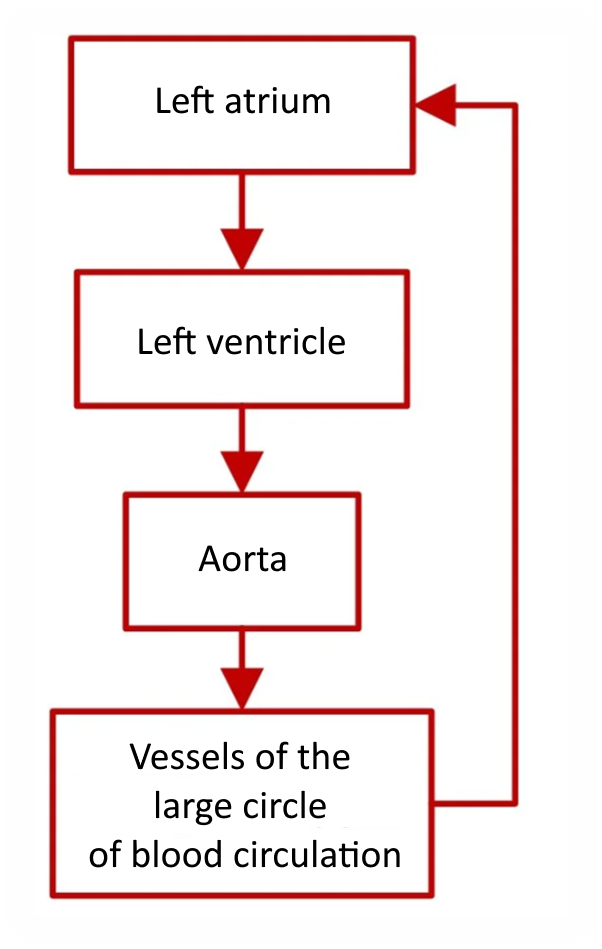
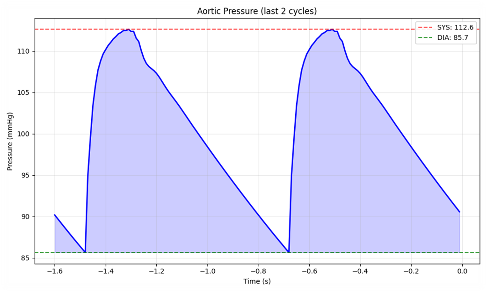
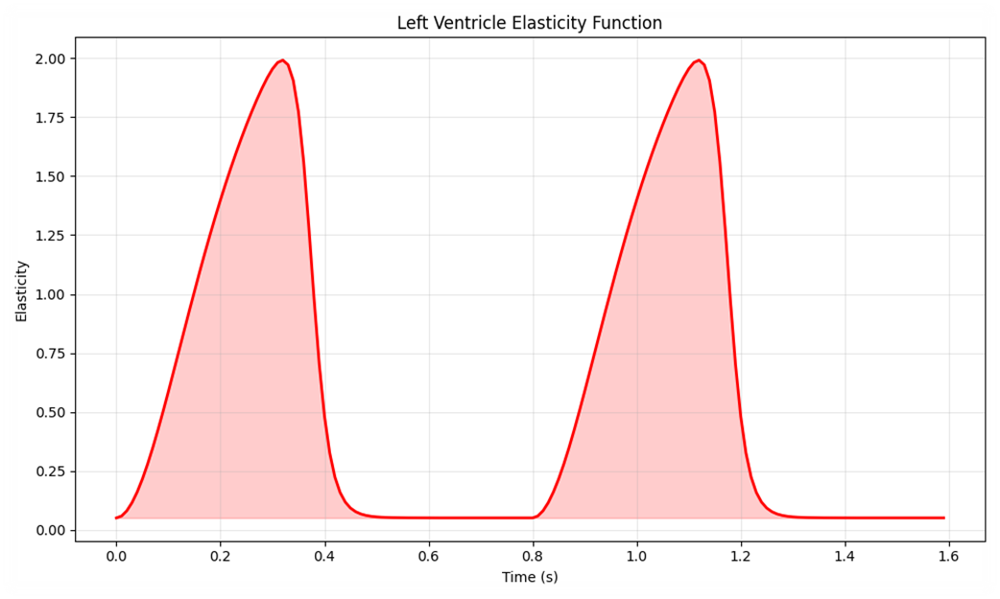
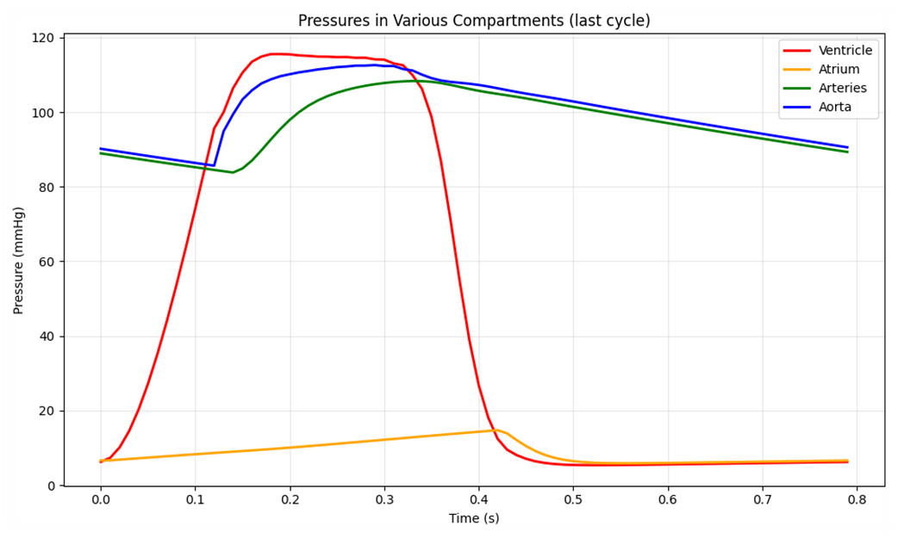
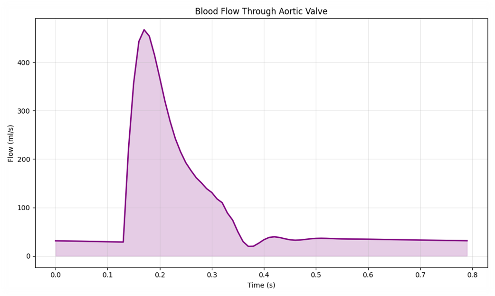

# HemodynLCBC

Pet-project that simulates the hemodynamics of the large circle of blood circulation. 
The project was inspired by a real-life task for medical engineers that was presented on [the website of the Sechenov MSMU.](https://theranostic.sechenov.ru/caseheart)

> This is a small pet-project, the essence of which was to try my hand at solving problems in biomedicine and to get a better understanding of hemodynamics. This project cannot be used to solve problems in real medicine, and it may contain factual errors and is not a verified and accurate solution to this problem, since the author (me) studied it independently and does not have expertise in this field.

## 📁 Content

<details>
<summary>Original task and the problems associated with it</summary>

  <br>

  <style>
  img.right-list {
    float: right;
  }
  img.left-list{
    float: left;
    margin-right: 20px; /* отступ справа, чтобы не было наложения */
  }
  </style>

  You can find the original task [here](https://theranostic.sechenov.ru/caseheart). Here, I will translate its text into English and explain what difficulties arose while trying to solve the task.
  
  
  
  To study the processes occurring in the circulatory system and the effects of implantable medical devices such as artificial heart valves and ventricular assist devices, models of the circulatory system are used. The models make it possible to determine the optimal patient state in a personalized way and can be included in a clinical decision support system.

  It is necessary to simulate the systemic circulation using any of the software packages (Matlab, Python, C++, etc.). The system of differential equations is presented in the appendix (formula (6)); for its numerical solution, it must be transformed according to the Euler method, generalized for systems of differential equations. The model parameters are presented in the appendix (Table 1).

  The appendix presents brief theory and the formulas necessary for modeling, the model parameters, and the vector of initial values for the system of differential equations.
  
  The answer to the problem is the value of the systolic pressure in the aorta for the last cycle (rounded to an integer value).

  <br clear="right">
  
  The main challenge I faced was a lack of materials necessary to solve the task. Therefore, I decided to approach it from a different angle. I reviewed the current solution to the issue and used AI to gather relevant initial data. This process helped me determine the approximate initial parameters for the model:

| Notation          | Value    | Unit of Measure   | Brief Description                               |
|       :---:       |   :---:  |  :---:            |  :---                                           |
| R1                | 1        | mmHg * s / mL     | Vascular segment resistance (Between C2 and C3) |
| R2                | 0.005    | mmHg * s / mL     | Mitral valve resistance                         |
| R3                | 0.013    | mmHg * s / mL     | Aortic valve resistance                         |
| R4                | 0.0398   | mmHg * s / mL     | Peripheral vascular resistance                  |
| C2                | 4.4      | mL / mmHg         | Capacitance of the first arterial chamber       |
| C3                | 1.33     | mL / mmHg         | Capacitance of the arterial chamber             |
| C4                | 0.8      | mL / mmHg         | Aortic capacitance                              |
| L                 | 0.0005   | mmHg * s**2 / mL  | Inductance (blood flow inertia)                 |
| dt                | 0.01     | s                 | Integration step (Euler's method)               |
| HR                | 75       | beats/min         | Heart rate                                      |
| Umax              | 2        | conv. units       | Maximum ventricular elastance                   |
| Umin⁡              | 0.05     | conv. units       | Minimum ventricular elastance                   |

And also, the X vector:

| Notation         | Value    | Unit of Measure | Brief Description     |
|  :---:           |  :---:   |  :---:          |  :---                 |
| x1               | 8        | mmHg            | Ventricular pressure  |
| x2               | 7.3      | mmHg            | Atrial pressure       |
| x3               | 70       | mmHg            | Arterial pressure     |
| x4               | 75       | mmHg            | Aortic pressure       |
| x5               | 20       | mL/s            | Blood flow velocity   |

As well as formulas. Compact recording of the ODE system for modeling a large circle of blood circulation:


$$
\begin{cases}

\dot{x_1} = \left(h - \dfrac{U}{R_2}H_{21} - \dfrac{U}{R_3}H_{14} \right) x_1 + \dfrac{U}{R_2}H_{21}x_2 + \dfrac{U}{R_3}H_{14}x_4   \\

\dot{x_2} = \dfrac{H_{21}}{R_2 C_2}x_1 - \left( \dfrac{1}{R_1 C_2} + \dfrac{H_{21}}{R_2 C_2} \right) x_2 + \dfrac{1}{R_1 C_2}x_3   \\

\dot{x_3} = \dfrac{1}{R_1 C_3}x_2 - \dfrac{1}{R_1 C_3}x_3 + \dfrac{1}{C_3}x_5   \\

\dot{x_4} = \dfrac{H_{14}}{R_3 C_4}x_1 - \left( \dfrac{H_{14}}{R_3 C_4} + \dfrac{1}{C_4} \right) x_4 - \dfrac{1}{C_4}x_5    \\

\dot{x_5} = -\dfrac{1}{L}x_3 + \dfrac{1}{L}x_4 - \dfrac{R_4}{L}x_5

\end{cases}
$$


$$
H_{21} = heaviside(x_2 - x_1) , H_{14} = heaviside(x_1 - x_4) , h(t) = \frac{\dot{U}(t)}{U(t)} .
$$

Now you can use all of this to solve the task from the beginning. 
If anything, I have tried to comment on my code as much as possible, so that you can understand it in case of any difficulties.

### ⚠️ Important:
1. Some of the comments and designations in this draft may be incorrect, as it was developed and studied independently, and I am not an expert in this field.
2. This project cannot be used to address real-world medical issues, as it is a learning project and does not fully represent what happens in the human body.

I'm always open to communication and constructive criticism. If you have more expertise on the subject - please just write to me about the mistake, I'd be very grateful. As the saying goes, he who makes no mistakes, makes nothing.

<br>

> P.S. Here are some useful materials that helped me complete the task. I hope they will be helpful to you too:
>
> P. I. Begun - Biomechanics (ISBN 5-7325-0309-5)
> > There are chapters on the biomechanics of the heart and the vascular system. Even during my self-study of biomechanics, I came across this book. It is written well and in a simple language.
> 
> B. I. Tkachenko - The basis of human physiology. A manual for the higher educational schools, in 2 volumes (ISBN 5-86050-055-6)
> > There are also chapters on hemodynamics. For the most part, I've already used this tutorial to test my work. It also contains useful materials for completing tasks.
> 
> L. Formaggia, A. Quarteroni, A. Veneziani Eds. - Cardiovascular mathematics. Modeling and simulation of the circulatory system (ISBN 978-88-470-1151-9)
> > The book is very close to the topic, as it describes it in detail. However, it was difficult for me to read and understand. There are a lot of formulas involved. Nevertheless, the book is still useful and may be more helpful to you than it was to me.
<br>
</details>


<details>
<summary>My decision and the results</summary>
  
  <br>

  

  - The shape of the graph (Fig. 1) is generally correct and corresponds to the classical [Tkachenko, Fig. 7.13], but there is no obvious dicrotic notch (rise) - this is a diagnostically significant element. Formally, there is a small bump that could be this notch, but it is insignificant, so we attribute all of this to the fact that the model is simplified.
  - Pulse pressure of 27 mmHg is below the physiological norm (40-50). This indicates that the model either overestimates the diastolic pressure or underestimates the systolic pressure.
  - As can be seen from the graph: **Aortic systolic pressure** = 112.6 mmHg, **Aortic diastolic pressure** = 85.7 mmHg.

  <br clear="right">
  
  
  
  - The elasticity curve (Fig. 2) has a characteristic two-phase shape with a peak E = 2.0 in the systole and a plateau in the diastole, which corresponds to the description of electromechanical coupling in the myocardium [Tkachenko, pp. 254-255, Fig. 7.10] and looks quite plausible.
  - In reality, the elasticity curve has an asymmetry (steeper rise than decline), although it turned out to be almost symmetrical. But this is a valid simplification for the educational model.

  <br clear="left">

  <br>

  
  
  - The graph (Fig. 3) is the most indicative, the comparison of which with Fig. 7.11 of Tkachenko's textbook demonstrates a qualitative coincidence of the phase structure of the cardiac cycle:
    - in systole, the pressure in the ventricle (red curve) increases sharply and exceeds the pressure in the aorta, which ensures the expulsion of blood;
    - the pressure in the aorta (blue curve) reaches a peak with a delay relative to the ventricle, which reflects the inertia and elasticity of the main vessels;
    - atrial pressure (yellow curve) remains low and increases smoothly towards the end of the diastole, reflecting venous return.
  - Quantitatively, the model gives a peak pressure in the ventricle of ~115 mmHg, whereas normally it can be 110-150 mmHg.. According to Tkachenko, p. 256, during the rapid expulsion phase it can reach 200 mmHg in the left ventricle and during the slow expulsion phase it can be 130-140 mmHg.
  - The pressure in the aorta is ~112 mmHg at its peak - the normal aortic systolic is 120-125 mmHg (p. 243), i.e. it is slightly underestimated.
  - Diastolic blood pressure is 85.7 mmHg - normally 70-75 mmHg (p. 243). That is, our blood pressure is overestimated by ~10-15 mmHg, which is why the pulse pressure is only 27 mmHg (normally 40-50).
  - There is no dicrotic rise at the catacroth of the aortic curve (Fig. 7.13, p. 261), which occurs when the semilunar valves close - in our case, the decline turned out to be monotonous.
  - The atrial pressure hardly pulsates - Tkachenko's (Fig. 7.11) has clear waves, and our yellow line is almost straight.

  <br clear="right">

  

  - The curve of the volumetric blood flow velocity (Fig. 4) has an expected peak (~470 ml/s) in the phase of rapid expulsion followed by a decrease. However, in diastole, the flow is not zero, but remains at ~30 ml/s, which is physiologically incorrect, since with the aortic valve closed, there should be no flow. This discrepancy is related to the numerical implementation of the valve boundary conditions and needs to be improved.
  - There is also no reverse current phase immediately after the valve is closed (incision), which is present in real physiology.

  <br clear="left">

---

The obtained values in numerical:
- **Aortic systolic pressure**: 112.6 mmHg
- **Aortic diastolic pressure**: 85.7 mmHg
- **Pulse pressure**: 27.0 mmHg
- **Mean arterial pressure**: 100.475 mmHg

---

**Summary**:
1. The implemented model accurately reproduces the phase structure of the cardiac cycle and the pressure ratios in various parts of the heart, which is confirmed by a comparison with Figure 7.11 in Tkachenko’s textbook.
2. The quantitative indicators (systolic, diastolic, and pulse pressure) deviate from the physiological norm, which indicates the need to calibrate the parameters (aortic elasticity, myocardial contractility, peripheral resistance), but it should be understood that there were deviations in the initial data as well, so we can assume that the "patient" is ill. If we substitute values considered normal, the values will be "as per the textbook". *(The validity of the model is also confirmed by the fact that the answer matches what is given for the task, aortic systolic pressure should be ~113)*
3. The model does not include a dicrotic rise in aortic pressure and zero diastolic flow through the aortic valve - these elements require a more detailed description of the valve apparatus and the elastic properties of the main vessels.
4. Despite the specified simplifications, the model can be used as an educational tool to demonstrate qualitative hemodynamics and to understand the relationship between myocardial contractility, vascular elasticity, and the formation of blood pressure.

</details>

## Project structure

```
HemodynLCBC/
├── results/    # Graphs and output data
├── main.py     # Main program
├── .gitignore
├── LICENSE
├── requirements.txt
└── README.md
```

## Model limitations

- There is no dicrotic rise in aortic pressure;
- The diastolic flow through the aortic valve is not equal to zero;
- The quantitative indicators of blood pressure deviate slightly from the physiological norm.

## 🛠️ Installation

### 1. Clone repository
```bash
git clone https://github.com/Wolffe104-fj/HemodynLCBC.git
cd HemodynLCBC
```

### 2. Create & activate virtual environment
```bash
python -m venv .venv
.\.venv\Scripts\Activate.ps1     # Windows (PowerShell)
source .venv/bin/activate        # Linux / macOS
```

### 3. Install dependencies
```bash
pip install -r requirements.txt
```

## Usage

### Run simulation
```bash
python main.py
```

## License

The code in this repository is distributed under the MIT license - see the LICENSE file.
